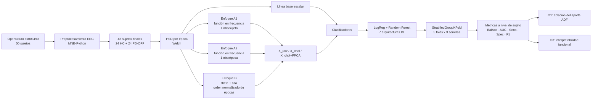

<div align="center">

# EEG + Functional Data Analysis + Deep Learning for Parkinson's Disease

### Reproducible research repository for resting-state EEG classification (HC vs PD-OFF)

**Lady Johana España Gamboa · Master's Degree in Artificial Intelligence and Data Science · 2026**


**[Tesis completa](docs/thesis.pdf)** · **[Arquitectura](docs/architecture.md)** · **[Metodología](docs/methodology.md)** · **[Reproducibilidad](docs/reproducibility.md)** · **[Resultados](docs/results.md)** · **[Auditoría del repositorio](docs/repository_audit.md)**

</div>

---

## ¿Qué contiene este repositorio?

Este repositorio reorganiza el proyecto académico **“Modelo basado en Deep Learning con Análisis de Datos Funcionales para la clasificación de pacientes con enfermedad de Parkinson usando señales de electroencefalograma”** en una estructura preparada para GitHub, sin alterar el planteamiento científico original.

El trabajo evalúa si representar la información espectral del EEG como **datos funcionales** aporta valor para clasificar **controles sanos (HC)** y **pacientes con enfermedad de Parkinson en estado OFF de medicación (PD-OFF)**. Se trabaja con EEG de reposo con ojos cerrados de la cohorte pública **OpenNeuro ds003490 (UNM)**. Tras control de calidad, el modelado utiliza **48 sujetos: 24 HC + 24 PD-OFF**.

> [!IMPORTANT]
> Este es un **prototipo de investigación**, no una herramienta de diagnóstico clínico. Sus predicciones experimentales no sustituyen la valoración de profesionales de salud.

## Vista rápida del estudio



### Diseño experimental clave

| Elemento | Implementación del estudio |
|---|---|
| Cohorte original | 25 HC + 25 PD, OpenNeuro `ds003490` |
| Cohorte final | 24 HC + 24 PD-OFF |
| Registro | Reposo, ojos cerrados |
| Canales utilizados | `C3, Cz, C4, P7, P8, P3, Pz, P4, O1, O2` |
| Preprocesamiento | referencia promedio, FIR 1-40 Hz, 250 Hz, ICA/EOG, épocas de 4 s, rechazo multicriterio |
| Estimación espectral | Welch, PSD por época |
| Enfoque A | función espectral en 4-13 Hz; A1 por sujeto y A2 por época |
| Enfoque B | trayectorias theta/alfa sobre el orden normalizado de épocas |
| Geometría funcional | matriz de Gram + transformación de Cholesky |
| Reducción | FPCA, ajustada dentro de la validación |
| Validación externa | `StratifiedGroupKFold`, 5 folds × semillas 42, 123 y 2024 |
| Modelos | LogReg, Random Forest, MLP, Transformer, CNN1D, FNN, FDNN, AdaFNN, EEGNet |

## Resultados principales

<div align="center">

| Configuración destacada | Balanced Accuracy | AUC |
|---|---:|---:|
| **A2 · LogReg · Cholesky+FPCA** | **0.824** | **0.902** |
| A1 · LogReg · Cholesky | 0.818 | 0.879 |
| B · Random Forest · Cholesky+FPCA | 0.781 | 0.849 |
| Modelo propuesto: A2 · FDNN · Cholesky+FPCA | 0.781 | 0.875 |
| Línea base escalar · Transformer | 0.732 | 0.814 |

</div>

La comparación controlada de ablación es esencial para interpretar esos valores: con regresión logística, la **PSD discretizada 4-13 Hz** y la representación **ADF + Cholesky** alcanzaron la misma exactitud balanceada media observada (**0.818**). Por ello, el aporte del ADF se interpreta principalmente como una forma **estructurada, compacta e interpretable** de representar la información espectral, y no como evidencia de superioridad predictiva sobre una PSD discretizada con información equivalente.

> [!NOTE]
> Las comparaciones entre configuraciones son **descriptivas**. El estudio no realiza un contraste inferencial formal de superioridad entre clasificadores.

## Evidencia visual

<table>
<tr>
<td width="50%"><br><sub><b>Caracterización espectral.</b> PSD relativa por regiones para HC y PD-OFF.</sub></td>
<td width="50%"><br><sub><b>Enfoque A.</b> Representación funcional de la información espectral.</sub></td>
</tr>
<tr>
<td width="50%"><br><sub><b>O1.</b> Comparación controlada del aporte específico del ADF.</sub></td>
<td width="50%"><br><sub><b>O3.</b> Funciones de peso reconstruidas para interpretabilidad frecuencial.</sub></td>
</tr>
</table>

## Estructura del repositorio

```text
parkinson-eeg-fda-deep-learning/
├── README.md
├── CITATION.cff
├── pyproject.toml
├── requirements.txt
├── environment.yml
├── Makefile
├── data/
│   └── README.md
├── docs/
│   ├── thesis.pdf
│   ├── architecture.md
│   ├── methodology.md
│   ├── reproducibility.md
│   ├── results.md
│   ├── traceability.md
│   ├── repository_audit.md
│   ├── licensing.md
│   └── assets/
├── notebooks/
│   ├── README.md
│   ├── 01_preprocessing.ipynb
│   ├── 02a_functional_frequency.ipynb
│   ├── 02b_functional_epoch_order.ipynb
│   ├── 04_modeling.ipynb
│   ├── 05_ablation_adf.ipynb
│   ├── 06_interpretability.ipynb
│   └── original/              # archivos entregados, sin modificar
├── src/parkinson_eeg_fda/     # utilidades reutilizables extraídas del flujo
├── scripts/
├── tests/
└── .github/workflows/ci.yml
```

## Ejecución rápida

### 1. Crear el entorno

Con `venv`:

```bash
python3.13 -m venv .venv
source .venv/bin/activate        # Windows: .venv\\Scripts\\activate
python -m pip install --upgrade pip
pip install -r requirements.txt
pip install -e . --no-deps
```

O con Conda/Mamba:

```bash
conda env create -f environment.yml
conda activate parkinson-eeg-fda
```

### 2. Descargar la cohorte pública

El repositorio **no redistribuye los EEG crudos**. Para descargar `ds003490` desde el bucket público de OpenNeuro:

```bash
bash scripts/download_openneuro.sh
```

Por defecto se crea `data/openneuro/ds003490/`. Puede cambiarse con `PARKINSON_EEG_DATA`.

### 3. Configurar rutas de trabajo

```bash
cp .env.example .env
export PARKINSON_EEG_DATA="$PWD/data/openneuro"
export PARKINSON_EEG_ROOT="$PWD/artifacts"
```

### 4. Ejecutar los notebooks en orden

```text
01_preprocessing.ipynb
        ↓
02a_functional_frequency.ipynb ─┐
02b_functional_epoch_order.ipynb ├─→ 04_modeling.ipynb
                                 │          ↓
                                 ├─→ 05_ablation_adf.ipynb
                                 └─→ 06_interpretability.ipynb
```

Los notebooks de la raíz de `notebooks/` son copias **portátiles y sin outputs**. Las versiones exactas entregadas, con sus salidas originales, se preservan en `notebooks/original/` para trazabilidad.

## Reproducibilidad y prevención de fuga de información

El diseño de validación utiliza al **sujeto como unidad de agrupación**. En A2, donde un individuo aporta varias épocas, todas las épocas del mismo sujeto permanecen en el mismo lado de cada partición. Las transformaciones dependientes de los datos —incluidas estandarización y FPCA— se ajustan con datos de entrenamiento y se aplican posteriormente al conjunto de prueba. En el entrenamiento profundo de A2, la separación interna por sujeto precede al ajuste de esas transformaciones.

Consulte **[docs/reproducibility.md](docs/reproducibility.md)** para el entorno documentado, semillas, orden de ejecución y diferencias observadas entre el manuscrito y los metadatos de los notebooks.

## Utilidades reutilizables

El paquete `src/parkinson_eeg_fda` extrae funciones pequeñas y testeables del flujo experimental:

```python
from parkinson_eeg_fda.functional import gram_matrix, cholesky_coordinates
from parkinson_eeg_fda.evaluation import aggregate_by_subject, classification_metrics
```

Los **notebooks originales siguen siendo la fuente ejecutable principal del experimento**; el paquete no pretende reescribir ni sustituir todos los detalles de la investigación.

## Verificación del repositorio

```bash
python scripts/validate_notebooks.py
python -m unittest discover -s tests -v
```

La integración continua ejecuta estas verificaciones sin descargar los EEG ni entrenar redes profundas.

## Trazabilidad académica

La correspondencia entre capítulos, figuras, tablas y cuadernos está documentada en **[docs/traceability.md](docs/traceability.md)**. Las decisiones de empaquetado y las inconsistencias encontradas durante la conversión a repositorio se registran de forma explícita en **[docs/repository_audit.md](docs/repository_audit.md)**.

## Citación

Si utiliza este repositorio, cite el trabajo académico y consulte `CITATION.cff`. El documento completo se conserva en `docs/thesis.pdf`.

## Licencia

Los materiales entregados no especifican una licencia de software de código abierto. Por ello, este repositorio **no asigna automáticamente una licencia**. Antes de publicarlo, defina explícitamente los términos de reutilización del código, el texto y las figuras. Véase `docs/licensing.md`.
