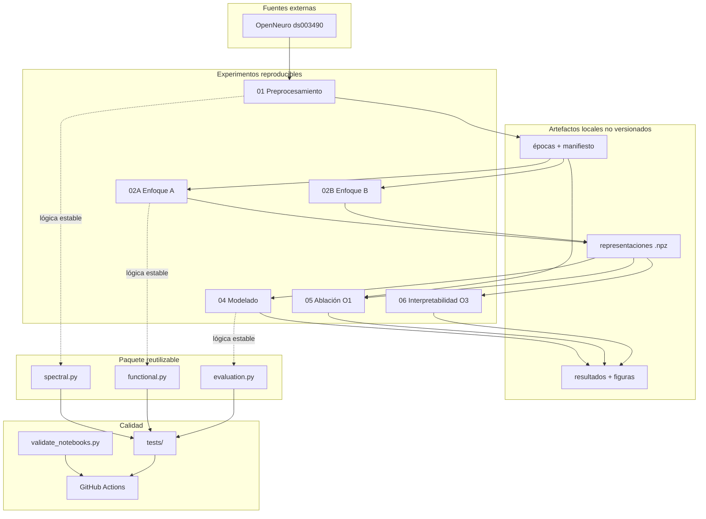

# Arquitectura del repositorio

La arquitectura prioriza tres objetivos: **fidelidad científica**, **reproducibilidad** y **mantenibilidad**. Por esa razón no se transformaron los seis cuadernos en una aplicación monolítica ni se ocultó el orden experimental detrás de una API nueva.

## Capas

### 1. `notebooks/original/`: evidencia histórica

Contiene exactamente los archivos entregados, con outputs y metadatos. Esta capa no se edita. Su función es permitir rastrear qué se ejecutó durante la investigación.

### 2. `notebooks/`: ejecución portátil

Mantiene la narrativa científica del proyecto, pero elimina outputs persistidos y desacopla las rutas del entorno Google Drive mediante variables de entorno. Es la entrada recomendada para una réplica.

### 3. `src/parkinson_eeg_fda/`: lógica reutilizable

Solo se extrajeron funciones pequeñas cuyo comportamiento puede probarse con datos sintéticos sin cambiar el diseño experimental: estimación espectral, geometría funcional y evaluación por sujeto. El entrenamiento completo permanece en los notebooks para evitar una reimplementación no validada.

### 4. `artifacts/`: productos de ejecución

No se versiona. La estructura reproduce la organización de resultados usada por los notebooks (`01_preprocesamiento`, `02A_enfoque_A`, etc.). Esto evita incluir en Git matrices grandes, checkpoints o datos derivados.

### 5. `docs/`: documentación científica y técnica

Incluye la tesis, metodología, resultados, trazabilidad, reproducibilidad, auditoría y política de licenciamiento pendiente.

### 6. `tests/` + CI

Los tests verifican propiedades matemáticas y de evaluación con arreglos sintéticos. La CI evita descargar el dataset y entrenar redes profundas; su alcance es detectar regresiones de empaquetado, sintaxis y utilidades reutilizables.

## Decisiones de arquitectura

1. **Notebooks como fuente experimental primaria.** Mantienen el vínculo directo con la tesis.
2. **Original y portátil separados.** La portabilidad no sobrescribe la evidencia histórica.
3. **Datos externos fuera de Git.** Se descargan desde OpenNeuro y los resultados se generan localmente.
4. **Configuración por entorno.** No se fijan rutas de usuario en el código portátil.
5. **Validación por sujeto como invariante.** Las utilidades y documentación mantienen al sujeto como unidad final de evaluación.
6. **Sin licencia inventada.** La elección legal queda explícitamente pendiente de la autora/institución.
